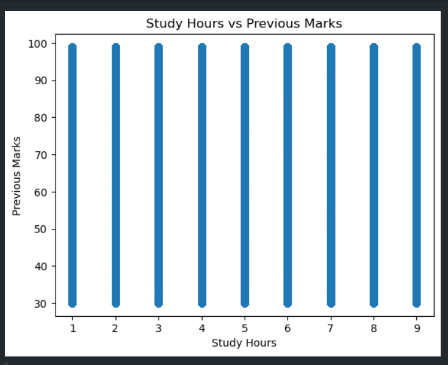
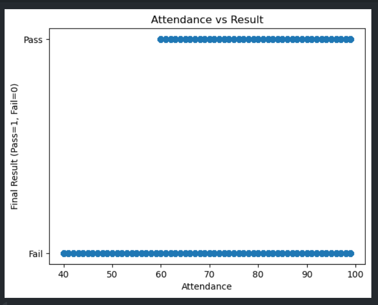
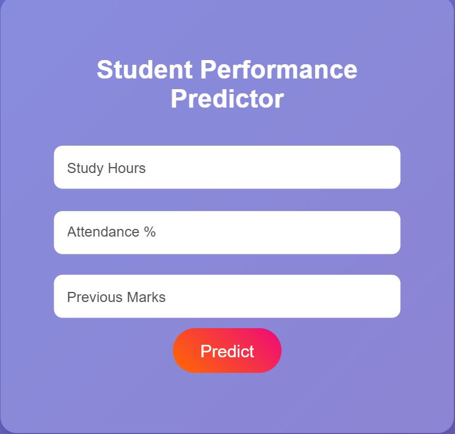
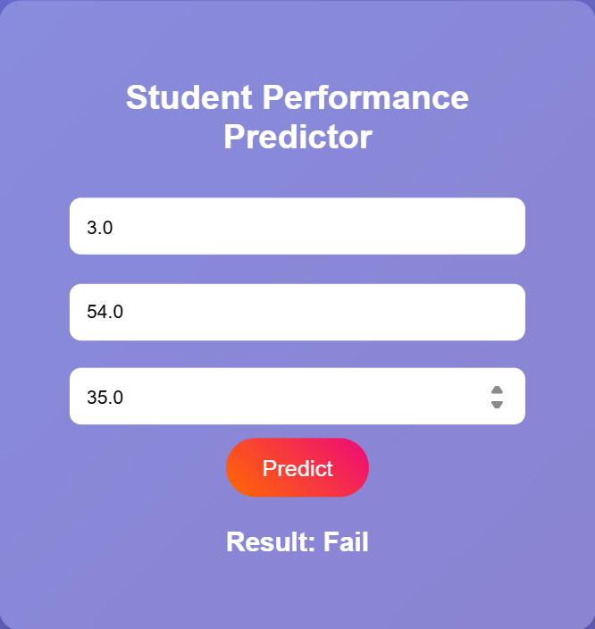
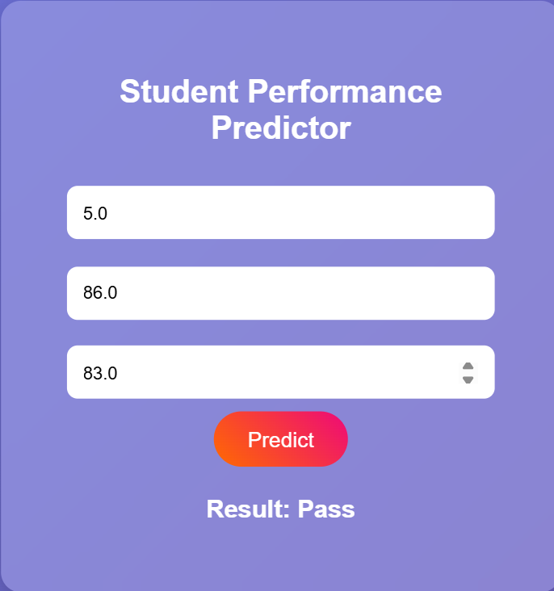

# 🎓 Student Performance Prediction System

A Machine Learning based web application that predicts whether a student will **Pass** or **Fail** based on academic performance indicators such as study hours, attendance, and previous marks.

---

## 📌 Project Overview

This project uses Machine Learning algorithms to analyze student academic data and predict student performance.  
The system is integrated with a Flask-based web application where users can input student details and get real-time predictions.

---

## 🚀 Features

- Predict student performance (Pass / Fail)
- User-friendly web interface
- Real-time prediction using Flask
- Machine Learning model integration
- Attractive and responsive UI

---

## 🛠️ Technologies Used

### Frontend
- HTML
- CSS

### Backend
- Python
- Flask

### Machine Learning
- Scikit-learn
- Pandas
- NumPy

---

## 📊 Machine Learning Algorithms Used

The following algorithms were implemented and compared:

- Logistic Regression
- Decision Tree
- Naive Bayes

The best-performing model was selected based on accuracy.

---

## 📁 Dataset Features

The dataset contains the following features:

- Study_Hours
- Attendance
- Previous_Marks
- Final_Result

Target Variable:
- Pass = 1
- Fail = 0

---

## 📂 Project Structure

project/
│
├── app.py
├── model.pkl
├── modeltraining.ipynb
├── templates/
│   └── index.html
│
└── student_dataset_100k.csv

---

## ⚙️ Installation & Setup

### 1️⃣ Install Required Libraries

```bash
pip install flask pandas scikit-learn numpy
```

### 2️⃣ Run the Application

```bash
python app.py
```

### 3️⃣ Open in Browser

```bash
http://127.0.0.1:5000/
```

---

## 🧠 Model Training Process

1. Data Preprocessing
2. Exploratory Data Analysis (EDA)
3. Feature Selection
4. Model Selection
5. Model Training
6. Prediction
7. Evaluation

---

## 📈 Evaluation Metrics

The model was evaluated using:

- Accuracy
- Precision
- Recall
- F1-Score
- Confusion Matrix

---

## 💻 Web Application

The web application allows users to:

- Enter Study Hours
- Enter Attendance Percentage
- Enter Previous Marks
- Predict Student Result

---

## 📷 Example Output

| Study Hours | Attendance | Previous Marks | Prediction |
|-------------|------------|----------------|------------|
| 8           | 90         | 85             | Pass       |
| 2           | 35         | 40             | Fail       |

---

## 🎯 Future Enhancements

- Grade Prediction (A/B/C)
- Student Performance Dashboard
- Graph Visualization
- Database Integration
- Cloud Deployment

---
## Screenshots

#  Graph 1


#  Graph 2


# output 1


# output 2


# output 3

---

## 👨‍💻 Author

Developed as a Machine Learning Mini Project using Python and Flask.

